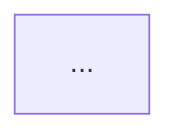

# 学术文档格式检查指南

本文件记录 `academic-format-cleaner` 的格式检查边界。正文润色、AI 腔清理和中文标点语义改写不放在这里。

## LaTeX

- `\cite{}` 紧贴被引文字，不在前面留空格。
- `\cite{}` 放在中文句号、逗号内侧：`结论\cite{key}。`
- `\label{}`、`\ref{}`、`\includegraphics{}`、`\cite{}` 的花括号不要跨行。
- 百分号写为 `\%`，除非确实是 LaTeX 注释。
- 数学环境、代码环境、绘图环境内只检查命令完整性，不做正文风格判断。

## Markdown

- fenced code block 和 YAML frontmatter 受保护，不做正文润色。
- 若需要清理标题层级、列表风格或代码块围栏，应在格式 skill 内完成。
- 正文中的 AI 腔和中文标点交给 `engineering-paper-humanizer`。

## Plain Text

纯文本输出必须完全去除 Markdown 格式标记，不能只是将 `.md` 文件改名为 `.txt`。

### 必须剥离的 Markdown 语法

| 类别 | Markdown 写法 | 纯文本处理 |
|------|--------------|-----------|
| 标题 | `# 标题` ~ `###### 标题` | 去掉 `#`，保留标题文字 |
| 加粗 | `**文字**` | 去掉 `**` |
| 斜体 | `*文字*` | 去掉 `*` |
| 行内代码 | `` `代码` `` | 去掉反引号 |
| 链接 | `[文字](url)` | 保留文字，去掉 URL |
| 图片 | `` | 替换为 `[图片: 描述]` |
| 无序列表 | `- ` / `* ` / `+ ` | 去掉标记符号 |
| 有序列表 | `1. ` / `1) ` | 去掉数字标记 |
| 引用 | `> 文字` | 去掉 `>` |
| 嵌套引用 | `> > 文字` | 去掉全部 `>` |
| 水平线 | `---` / `***` / `___` | 替换为单个空行 |
| 代码块围栏 | ` ``` ` / ` ~~~ ` | 去掉围栏行，保留内容 |

### 表格处理

纯文本中无法直接表示复杂表格，按以下规则处理：

- **窄表格（≤3 列）**：转为逐行 key-value 格式
  ```
  参数名: 数值
  单位: mm
  ```
- **宽表格（≥4 列）**：单空格分隔，每行末尾无空格
  ```
  列1 列2 列3 列4
  值1 值2 值3 值4
  ```
- 表格前后各留一个空行，与正文分隔
- 表头行与分隔行不保留在纯文本中

### 图表代码块保护

Mermaid、Python matplotlib、Graphviz DOT 等图表代码块在纯文本转换时**保留围栏和完整代码**，不剥离。转换后在块前插入渲染说明：

```
[图表代码：图X-X 标题 — 可在 mermaid.live 或对应工具中渲染]

```

此规则涵盖 Mermaid（` ```mermaid `）、Python matplotlib（` ```python ` 中含 `matplotlib` 或 `plt.`）、Graphviz DOT（` ```dot `）。渲染说明中写明图表编号和标题，方便后续在 Word 中重新插入或引用。

### 自动转换

使用 `check_format.py --fix --format plain` 自动完成 Markdown → 纯文本剥离：

```bash
python scripts/check_format.py draft.md --format plain --fix --output output.txt
```

转换后再运行检查确认无残留：

```bash
python scripts/check_format.py output.txt --format plain
```
