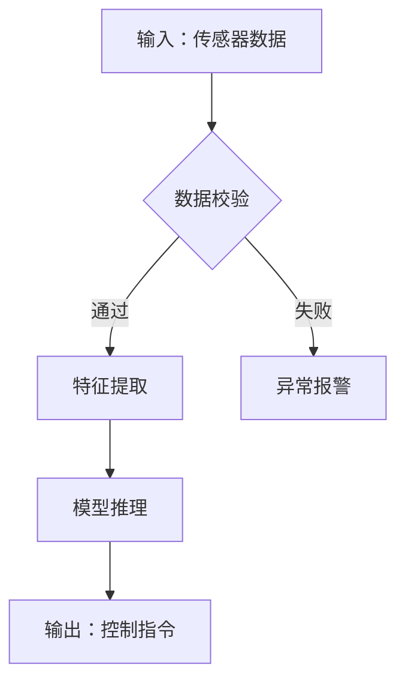
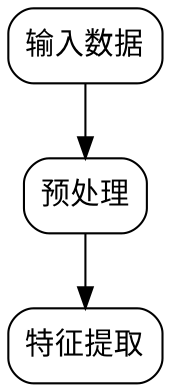

# 图表生成指南

本文件为中文工程论文的图表规划与生成提供指导。

## 数据图的处理路径

中文工程论文的数据图通常来自：
- **仿真软件截图**：ANSYS/Fluent/COMSOL/ADAMS 等直接导出 → 用户提供，Skill 不代画。
- **实验设备导出**：数据采集卡、传感器系统、测试台导出 → 用户提供原始数据。
- **Matlab/Origin/Excel 绘图**：用户从数据处理软件导出 → 如用户请求帮助，可生成 Python 绘图脚本。

Skill 可以协助的图表类型：数据结果图（Python matplotlib 脚本，标准库可运行）。

## 流程图/架构图提示词模板

当论文需要研究路线图、系统架构图、算法流程图时，生成画图提示词供生图 AI 使用：

### 流程图模板

```
绘制一个学术论文级别的流程图，展示"[流程名称]"。

【布局】从上到下，白色背景，专业学术风格。
【步骤】
步骤1：[名称] — 蓝色圆角矩形
  内容：[描述]
步骤2：[名称] — 橙色圆角矩形
  与步骤1关系：[箭头标注]
...
【配色】
- 蓝色(#4E79A7)：输入/准备步骤
- 橙色(#F28E2B)：核心处理步骤
- 绿色(#59A14F)：输出/结果步骤
【风格】圆角矩形，清晰箭头，关键步骤加粗边框。
```

### 系统架构图模板

```
绘制一个学术论文级别的系统架构图，展示"[系统名称]"。

【整体布局】从上到下或从左到右的层次结构。
【分层描述】
输入层：[模块名、主要元素]
处理层：[模块名、主要算法/组件]
输出层：[模块名、结果形式]
【配色】
- 蓝色系：输入/数据层
- 橙色系：核心处理层
- 绿色系：输出/结果层
- 红色虚线框：创新标注
【标注要求】每模块标注名称，关键参数标注，创新点用红色虚线框。
```

## 表格规范

- 中文工程论文表格优先使用三线表。
- 表头：参数名 | 数值 | 单位。
- 数据精度一致，小数点位数统一。
- 如为复现运行结果，标注 mean ± std 或置信区间。
- 表格必须有表序和表题，表序按章编号（如"表 3-2"）。

## 简单流程图直接生成

对于简单流程图、系统架构图、算法流程图，不依赖外部 AI 生图工具，直接产出可渲染的代码：

### 方案对比

| 方案 | 适用场景 | 渲染命令 | 输出格式 |
|---|---|---|---|
| **Mermaid.js** | 流程图、架构图、时序图、甘特图 | Mermaid Live Editor / Pandoc + mermaid-filter | PNG / SVG |
| **Python matplotlib** | 简单框图、数据流程图、模块示意 | `python script.py` | PNG / PDF |
| **Graphviz DOT** | 关系图、层次图、依赖图 | `dot -Tpng input.dot -o output.png` | PNG / SVG |

### Mermaid 路径（推荐首选）

生成 Mermaid 代码块作为可渲染附件：

````markdown

````

用户可通过以下方式渲染：
1. [Mermaid Live Editor](https://mermaid.live/) 在线粘贴 → 导出 PNG/SVG
2. Pandoc：`pandoc input.md --filter mermaid-filter -o output.pdf`
3. Typora / VS Code 等编辑器的 Mermaid 预览插件直接导出

### Python matplotlib 路径

生成可直接运行的 Python 脚本，产出矢量图：

```python
import matplotlib.pyplot as plt
import matplotlib.patches as mpatches

fig, ax = plt.subplots(figsize=(8, 5))
ax.set_xlim(0, 10)
ax.set_ylim(0, 6)
ax.axis('off')

# 绘制模块
box = mpatches.FancyBboxPatch((1, 4), 3, 1, boxstyle="round,pad=0.1",
                               facecolor="#4E79A7", edgecolor="black")
ax.add_patch(box)
ax.text(2.5, 4.5, "传感器数据采集", ha='center', va='center', fontsize=10, color='white')

# ... 更多模块

plt.tight_layout()
plt.savefig("flowchart.png", dpi=300, bbox_inches='tight')
```

### Graphviz DOT 路径

生成 DOT 描述文件：



渲染：`dot -Tpng flowchart.dot -o flowchart.png`

### 动作规则

在规划阶段，对于每处流程图/架构图占位符判断生成路径：
- 步骤型流程（步骤≤10）→ Mermaid
- 模块型框图（矩形+箭头）→ matplotlib 或 Mermaid
- 层次/关系型 → Graphviz DOT
- 复杂示意图（需要自由绘制）→ 提示词模板（见上方"流程图模板"）

## 图表插入点规则

- `[此处插入图片：...]` 放在正文第一次引用的位置。
- `[此处插入表格：...]` 放在正文第一次引用的位置。
- 章尾图表汇总清单只用于参考，不能替代正文中的插入点。

Mermaid/matplotlib/DOT 代码块在后续格式转换阶段（format-cleaner）的保护规则见 format-cleaner 参考文件 `format-guide.md` §图表代码块保护。
